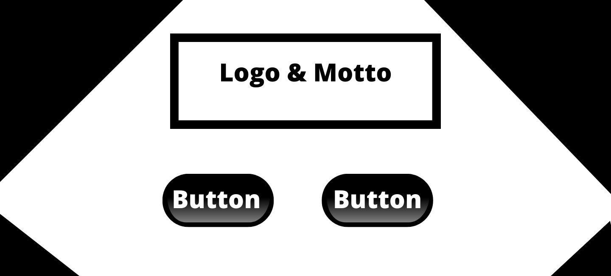
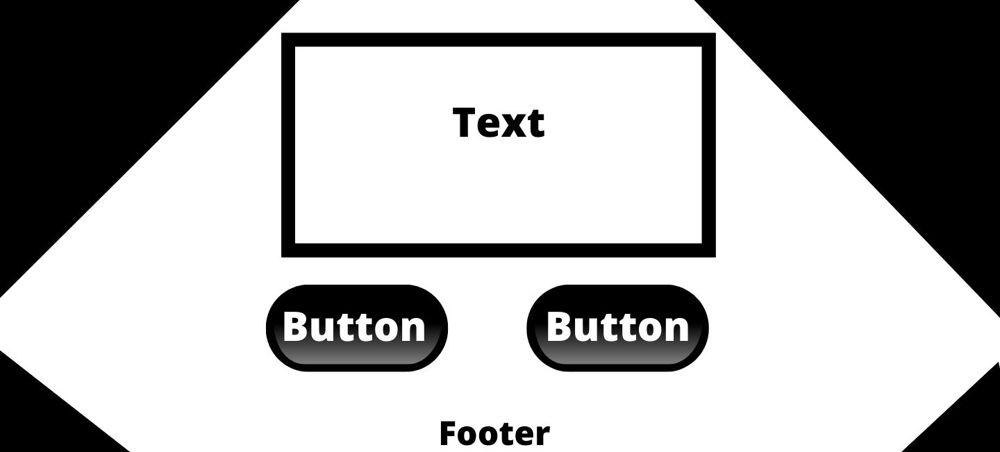
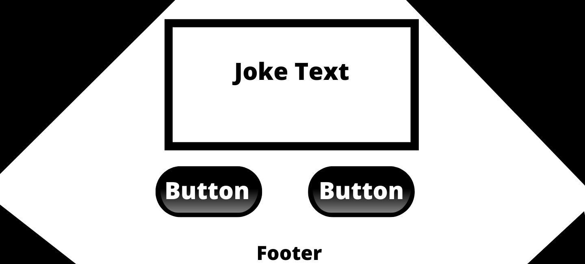
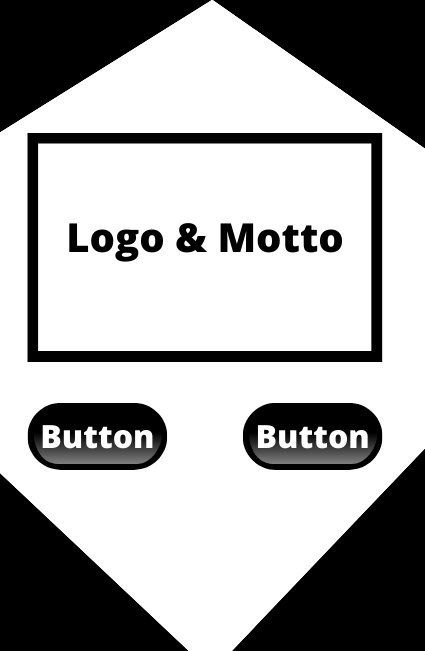
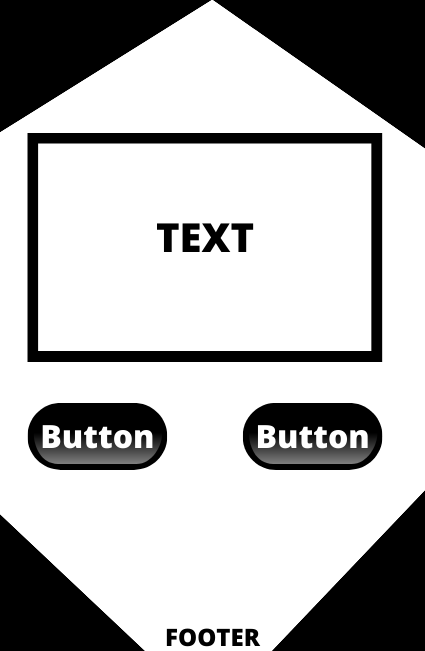
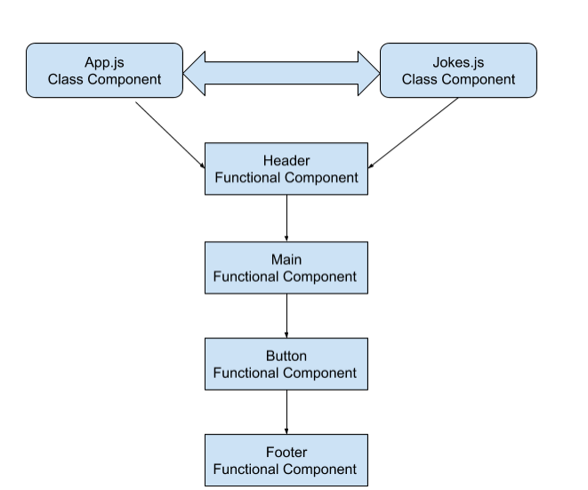

  

# Vivid

The title of this website is Vivid.
Motto: 

<h2>Description</h2>
Vivid is a an app to help you fight boredom. This app will help you find unlimited things to do when you find yourself bored. The app will list random activities with a random number of participants. The types of activities range from educational, relaxation, cooking, etc. There is no reason to have idle time when you have Vivid!

<h2>Wireframes</h2> 
<h3>Desktop -</h3>

<h3>Tablets and Mobile -</h3>

<h2>Component Hierarchy</h2> 

<h2>API</h2>
https://www.boredapi.com/

<h2>MVP</h2>
Minimum Goals - Create 6 components, place proper routes, and utilize Storybook to create 5 reuseable components. Need to have features: the ability for people to select the button if they like the task or do not like the take. The option for someone to have a funny joke told to them if they do not wish to complete the task. 

<h2>Post-MVP</h2>
Nice to have features - A graph or some type of fun feature showing how many people actually completed the tasks given to them so it can encourage others to complete the task. 

<h2>SWOT Analysis</h2>
I will overcome my weakness by starting on those areas first to minimize any errors later in the week. 
